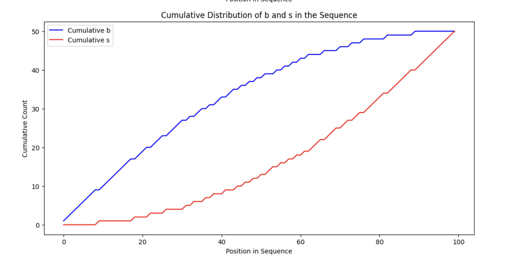
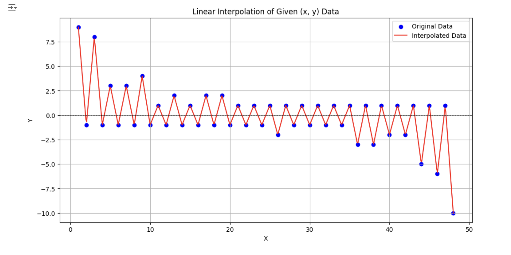
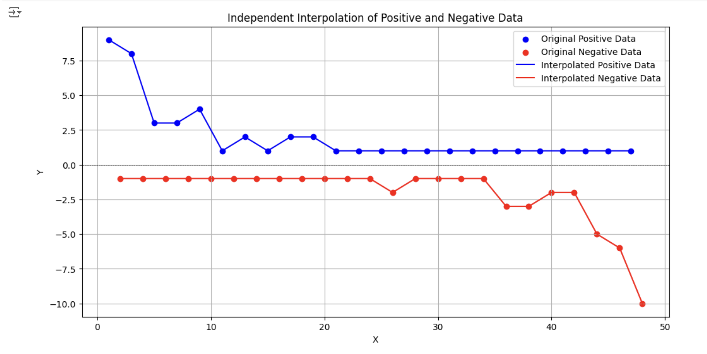
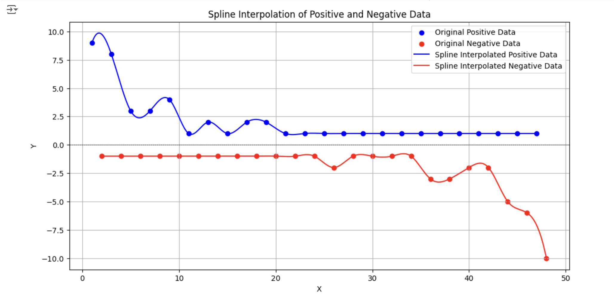
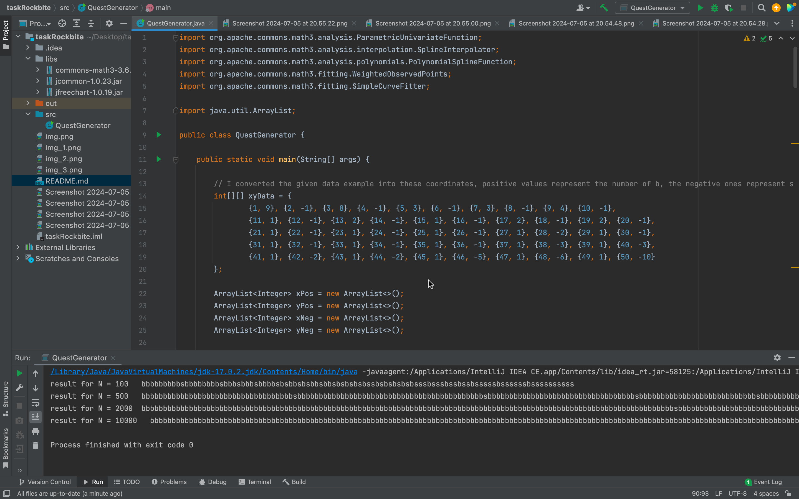
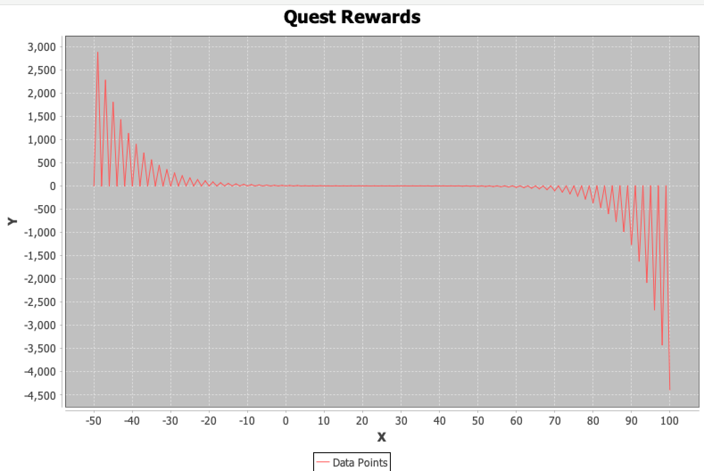

First of all, I tried to analyze data find patterns. I used graphing techniques to undrstand data.

I noticed that we can separate the positives values and negative ones

I understood that I have to interpolate the blue and red graphs and predict their continuation, the shape somehow reminds for exponential decay and inverse exponential decay.
 
I refactored the given data, I counted the first number of b and maped the value to 1, then i counted the next occurance of s and mapped into 2. So I converted the string sequence into the sequence of (x,y) coordinates and b is represented as positive number and s is represented as negative number. 
here is the result

{1, 9}, {2, -1}, {3, 8}, {4, -1}, {5, 3}, {6, -1}, {7, 3}, {8, -1}, {9, 4}, {10, -1},
{11, 1}, {12, -1}, {13, 2}, {14, -1}, {15, 1}, {16, -1}, {17, 2}, {18, -1}, {19, 2}, {20, -1},
{21, 1}, {22, -1}, {23, 1}, {24, -1}, {25, 1}, {26, -1}, {27, 1}, {28, -2}, {29, 1}, {30, -1},
{31, 1}, {32, -1}, {33, 1}, {34, -1}, {35, 1}, {36, -1}, {37, 1}, {38, -3}, {39, 1}, {40, -3},
{41, 1}, {42, -2}, {43, 1}, {44, -2}, {45, 1}, {46, -5}, {47, 1}, {48, -6}, {49, 1}, {50, -10}

The graphs all are created based on this.
At first, I was thought about Hidden Markov chain model, reinforcement learning models, but the result was not so good So i tried other thing.
Then I used mathematical clamped spline interpolation and extrapolation techniques to predict the values, and combined them in an arraylist.
The problem says that the generated sequence has to work for 10000, so I desiged my function to work uo to 10000, bigger values may arise errors.

I created a sequence for x coordinates -25 to 100, and computed the corresponding y values in that range and combined all y coordinates in one arraylist.
Then the coordinates I converted into b and s sequence. I started from the middle, the x coordinate x (75 th element in the created arraylist), I looped right and left simultaneously to combine the string result correctly.

The algorthitm is guaranteed to give same sequence for given N.

I tried to use StringBuffer instead of traditional string to make it work efficient, and used arraylists instead of arrays.

I used dependencies
commons-math3-3.6.1.jar
commons-1.0.23.jar
jfreechart-1.0.19.jar

the final result screenshot

